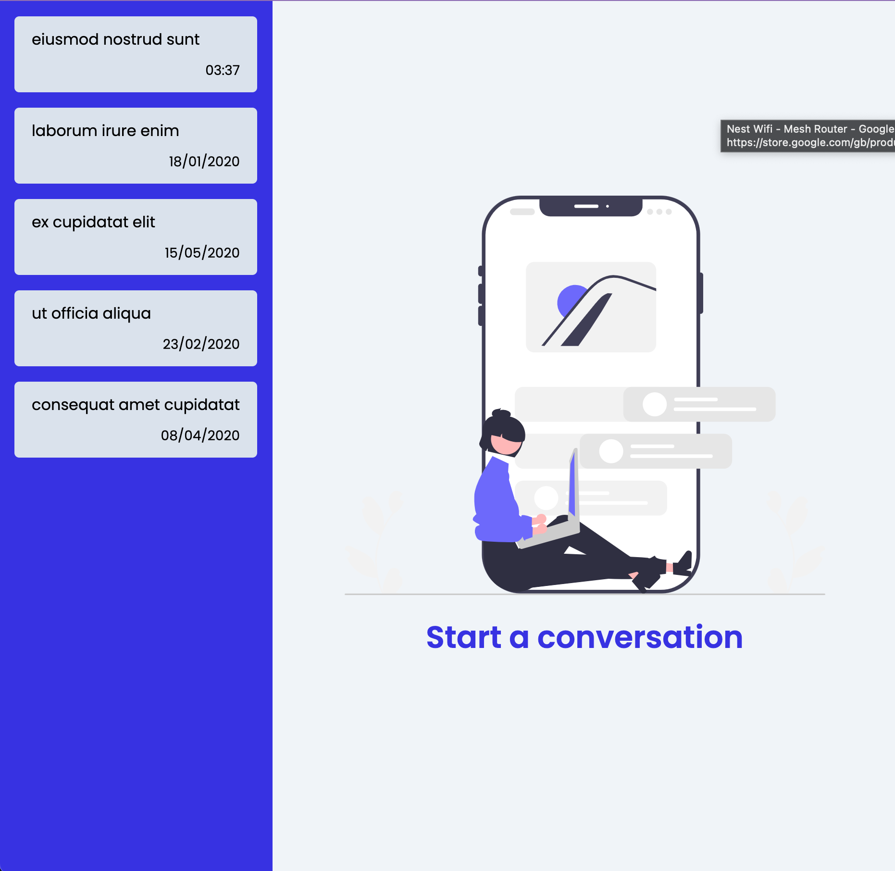
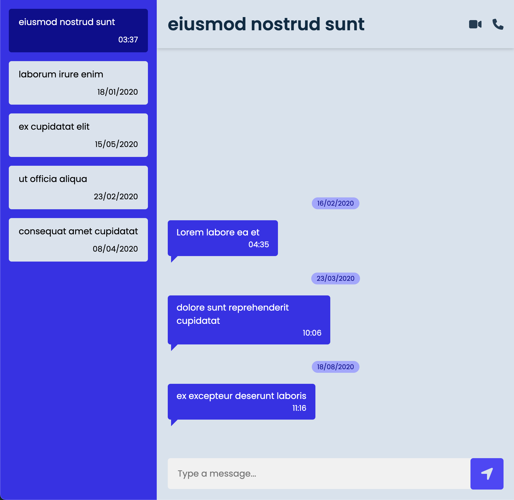
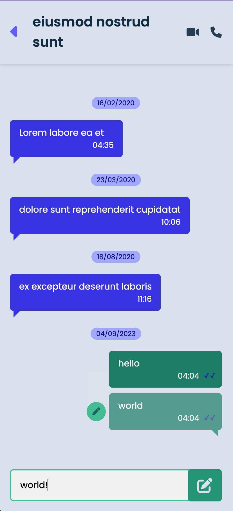
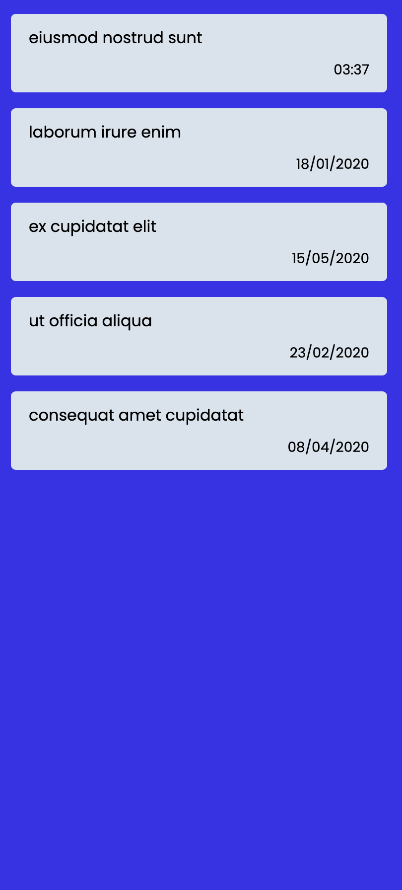
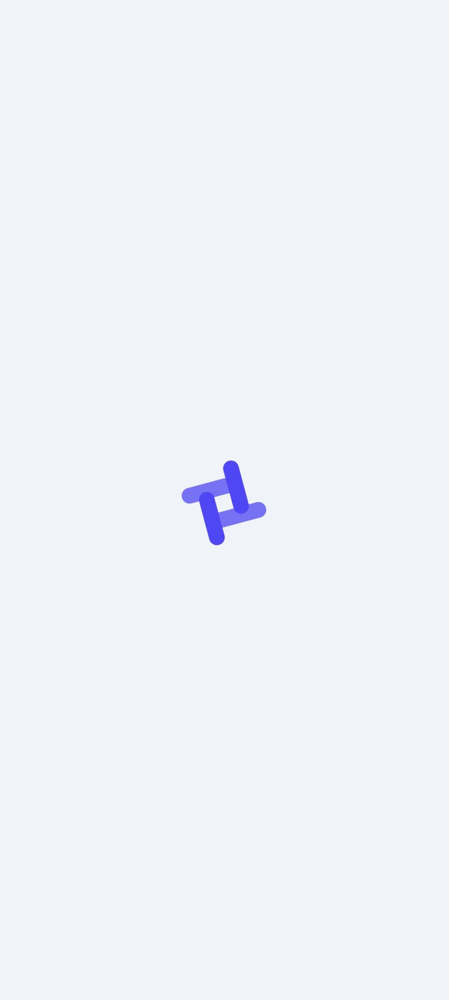

# Blink Chat App

Deployed using Netlify: [https://blink-chat-app.netlify.app/](https://blink-chat-app.netlify.app/)

## Libraries

- **React**: Front-end framework (created with create-react-app)
- **TypeScript**: Strong typing and code maintainability
- **axios**: For fetching local data
- **CSS Modules + clsx**: For modular CSS
- **Jest**: Testing

## Methodologies

- **BEM (Block-Element-Modifier)**: For more structured CSS

## Architecture

### `App` Component

- Fetches data from JSON using axios HTTP GET
- Saves conversations in state
- Uses derived state (`useMemo`) for sorted conversations
  - More efficient than sorting data upon fetching and on every update
- Handles loading state with spinner component
- Handles error states with a message in the browser
- Active conversation ID is saved in state

### `ConversationList` Component

- Renders a list of sorted conversations (descending)
- Displays locale time in each list item if the conversation was updated today; otherwise, displays locale date
- Takes full viewport width on <= tablet screens (768px)
- Active conversation is highlighted

### `ActiveConversation` Component

- Renders sorted list of messages (ascending) for the active chat
  - A date badge is shown for new dates (similar to WhatsApp)
  - Renders `MessageCard` component for each message
- **Editing**
  - `editingMessageId` is saved in state
  - `editingMessage` object is derived using `useMemo`
- **Scroll Position**
  - Defaults scroll position to bottom when chat is selected
  - Sets scroll position to bottom when new messages are sent
- header component displays a expand button for the `ConversationList` sidebar component in views <= tablet

### `MessageCard` Component

- Displays:
  - Message text
  - `edited` state (if edited)
  - `last_updated` timestamp (only time, not date)
  - `status`: either 'sending', 'sent', 'delivered', 'read' (mocked, as we don't have a server)
- `edit` icon is shown on hover and persists when a message is being edited

### `InputMessage` Form Component

- Uses a form so that the enter key submits as well as the button element
- Visually different states for writing new messages and editing a message
- Uses `useEffect` to populate input and focus when editing a message
- Clears input and stops editing after form submission

### `NoConversation` Component

- Only displays on screens > tablet size (768px)

## Accessibility

- Semantic HTML used (e.g., `aside` for sidebar, `h1` for chat names, `alt` attributes for images)
- Aria labels on form elements
- Could have been improved with more time (e.g., using `rem` units instead of pixels)

## Testing

- Only the `InputMessage` component was tested due to time constraints
  - Covered all conditional states (editing, non-editing, empty input, non-empty input)
